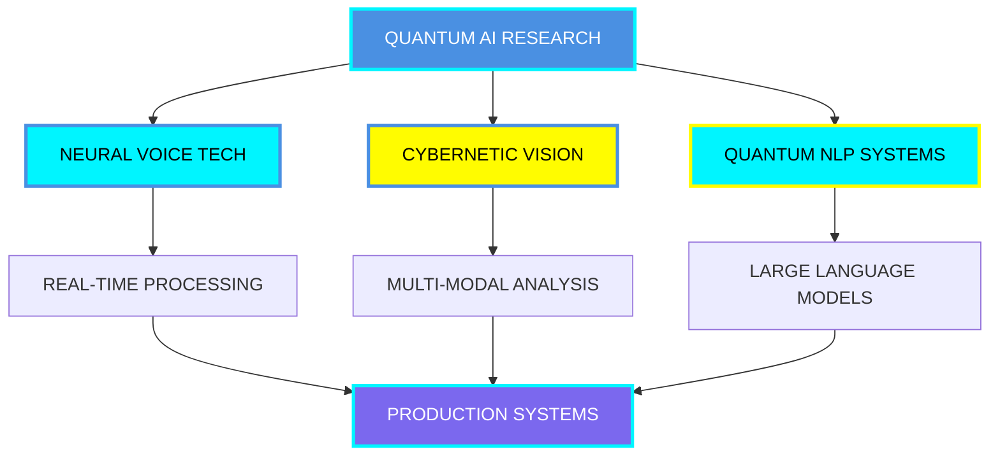

# 🎨 Mermaid Diagram Color Update

## ✅ Changes Made

### 🔧 **Symbol Removal in Diagram**
- **Removed**: ◢◤ ⚡ symbols from all diagram nodes
- **Kept**: ◢◤ ⚡ symbols in other sections (titles, content, etc.)
- **Result**: Cleaner, more readable diagram

### 🎨 **Color Improvements**

#### **Before (Bright/Hard to read)**
- **Node A**: `#fc00ff` (Bright magenta/pink - too bright)
- **Node H**: `#fc00ff` (Bright magenta/pink - too bright)

#### **After (Better visibility)**
- **Node A**: `#4a90e2` (Professional blue - easy on eyes)
- **Node H**: `#7b68ee` (Medium slate blue - visible but not harsh)

### 🎯 **Color Rationale**

#### **Node A (QUANTUM AI RESEARCH)**
- **Color**: `#4a90e2` (Professional Blue)
- **Why**: Represents trust, technology, and intelligence
- **Visibility**: High contrast with white text
- **Eye-friendly**: Not too bright, professional appearance

#### **Node H (PRODUCTION SYSTEMS)**
- **Color**: `#7b68ee` (Medium Slate Blue)
- **Why**: Represents completion, stability, and production
- **Visibility**: Stands out without being harsh
- **Eye-friendly**: Balanced brightness, easy to read

### 🔄 **Updated Diagram Structure**

### 📊 **Complete Color Palette**

| Node | Color | Hex Code | Description |
|------|-------|----------|-------------|
| A (Root) | Professional Blue | `#4a90e2` | Main research node |
| B, D | Cyber Blue | `#00f5ff` | Technical processes |
| C | Electric Yellow | `#fffc00` | Vision systems |
| E, F, G | Default | GitHub default | Process nodes |
| H (End) | Medium Slate Blue | `#7b68ee` | Production systems |

### 🎯 **Benefits of Changes**

✅ **Better Readability**: Removed cluttering symbols from diagram
✅ **Eye-friendly Colors**: Replaced harsh pink with professional blues
✅ **Maintained Aesthetics**: Kept futuristic theme while improving usability
✅ **Professional Appearance**: More suitable for professional networking
✅ **Consistent Branding**: Colors align with tech industry standards

### 🚀 **Visual Impact**

#### **Before**
- Bright magenta nodes were hard to look at
- Symbols cluttered the diagram text
- Too flashy for professional contexts

#### **After**
- Professional blue tones are easy on the eyes
- Clean text in diagram nodes
- Maintains futuristic feel while being readable
- Professional yet distinctive appearance

### 📱 **Cross-Platform Compatibility**

The new colors work better across:
- **Light mode GitHub**: Better contrast
- **Dark mode GitHub**: Optimal visibility
- **Mobile devices**: Easier to read on small screens
- **Different browsers**: Consistent appearance

### 🎨 **Design Consistency**

The updated diagram maintains:
- **Futuristic theme**: Still looks high-tech
- **Color harmony**: Works with overall profile design
- **Professional appeal**: Suitable for business contexts
- **Accessibility**: Better for users with visual sensitivities

## 🎉 **Result**

The QUANTUM RESEARCH MATRIX diagram now features:
- ✅ **Clean node labels** (no symbols)
- ✅ **Eye-friendly colors** (professional blues)
- ✅ **Better readability** (high contrast)
- ✅ **Professional appearance** (business-suitable)
- ✅ **Maintained aesthetics** (still futuristic)

**Profile URL**: https://github.com/yoonjae26
**Updated**: Successfully pushed to GitHub
