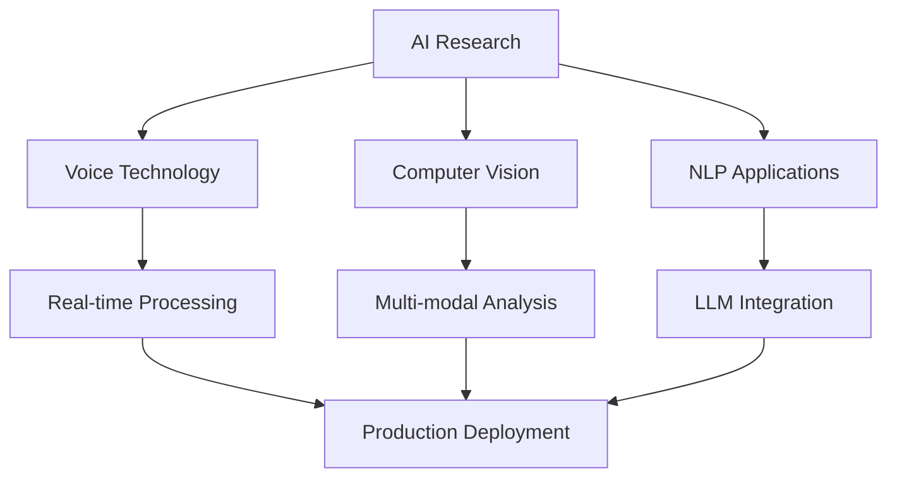

<div align="center">
  
</div>

<div align="center">
  
# 🚀 Yoon Jae | AI Developer
  


</div>

---

## �‍💻 About Me

```python
class AIEngineer:
    def __init__(self):
        self.name = "Yoon Jae"
        self.role = "AI Developer & ML Engineer"
        self.location = "Jeju Island, South Korea 🏝️"
        self.education = "Jeju Halla University"
        self.languages = ["Python", "JavaScript", "Korean", "English"]
        
    def current_focus(self):
        return [
            "🧠 Natural Language Processing",
            "🎤 Voice Synthesis & Cloning",
            "👁️ Computer Vision Applications",
            "🤖 Deep Learning Research"
        ]
    
    def daily_routine(self):
        return "Code → Train Models → Deploy → Repeat 🔄"
```

<div align="center">
  
### 🎯 **Specializing in AI/ML with focus on practical applications**
  
</div>

## �️ Tech Arsenal

<div align="center">

### Core Technologies


### AI/ML Ecosystem


### Development Tools


### Specializations


</div>

## 🌟 Featured AI Projects

<div align="center">

| Project | Description | Tech Stack | Status |
|---------|-------------|------------|--------|
| 🎤 **[Voice Cloning System](https://github.com/yoonjae26/Real-Time-Voice-Cloning)** | Real-time voice synthesis in 5 seconds | `Python` `Deep Learning` `Audio Processing` | ✅ Active |
| 🤖 **[AI Face Analytics](https://github.com/yoonjae26/face_estimation)** | Multi-modal face analysis (age, gender, emotion) | `Python` `OpenCV` `Custom ML Models` | ✅ Active |
| 🗣️ **[Advanced TTS Engine](https://github.com/yoonjae26/coqui-ai-TTS)** | Production-ready Text-to-Speech system | `Python` `Deep Learning` `Coqui AI` | ✅ Active |
| 📚 **[NLP Research Hub](https://github.com/yoonjae26/intronlp-2024)** | Large Language Models & NLP experiments | `Python` `Transformers` `Jupyter` | 🔄 Learning |
| � **[Auto Content Generator](https://github.com/yoonjae26/CafeBlog-AutoPostGen)** | Automated blog post generation system | `Python` `NLP` `Automation` | ✅ Active |

</div>

### 🔥 Project Highlights

<details>
<summary><b>🎤 Real-Time Voice Cloning</b></summary>

- **Revolutionary Voice Synthesis**: Clone any voice with just 5 seconds of audio
- **Real-time Processing**: Generate speech in real-time with minimal latency
- **Production Ready**: Optimized for performance and scalability
- **Applications**: Voice assistants, content creation, accessibility tools

</details>

<details>
<summary><b>🤖 AI Face Analytics</b></summary>

- **Multi-Modal Analysis**: Simultaneous age, gender, and emotion detection
- **Custom ML Models**: Self-trained models for enhanced accuracy
- **Real-time Processing**: Live video stream analysis
- **Applications**: Security systems, customer analytics, healthcare

</details>

<details>
<summary><b>🗣️ Advanced TTS Engine</b></summary>

- **Enterprise-Grade**: Battle-tested in research and production environments
- **Multi-Language Support**: Support for various languages and accents
- **Customizable Voices**: Train custom voice models
- **High Quality Output**: Natural-sounding speech synthesis

</details>

## 📊 GitHub Analytics

<div align="center">
  


</div>

<div align="center">
  


</div>

<div align="center">
  


</div>

---

## 🎯 Current Mission

<div align="center">



</div>

### 🚀 Active Focus Areas
- 🧠 **Deep Learning Research**: Exploring cutting-edge neural architectures
- 🎵 **Voice AI Innovation**: Pushing boundaries in speech synthesis
- 👁️ **Computer Vision**: Real-world applications of visual AI
- 🤖 **Open Source**: Contributing to the AI community

### 🌟 2025 Roadmap
- [ ] **Q1**: Launch comprehensive AI toolkit
- [ ] **Q2**: Contribute to major open-source AI projects
- [ ] **Q3**: Publish research papers on voice technology
- [ ] **Q4**: Build production-ready AI SaaS platform

## 🤝 Let's Connect & Collaborate

<div align="center">

### 📬 **Ready to discuss AI, collaborate on projects, or just chat about tech?**

[](https://linkedin.com/in/yoonjae26)
[](https://www.facebook.com/profile.php?id=100033933143471)
[](mailto:nguyenhoanglinh260801@gmail.com)
[](https://yoonjae26.github.io)

</div>

### 💡 **Open to:**
- 🚀 **AI/ML Project Collaborations**
- 📚 **Research Partnerships**
- 💼 **Consulting Opportunities**
- 🎓 **Mentoring & Knowledge Sharing**
- 🌟 **Open Source Contributions**

---

<div align="center">
  
### 🔮 **"Building the future, one AI model at a time"**


</div>

<div align="center">
  
**⭐ From [yoonjae26](https://github.com/yoonjae26) | Made with ❤️ and lots of ☕**


</div>
