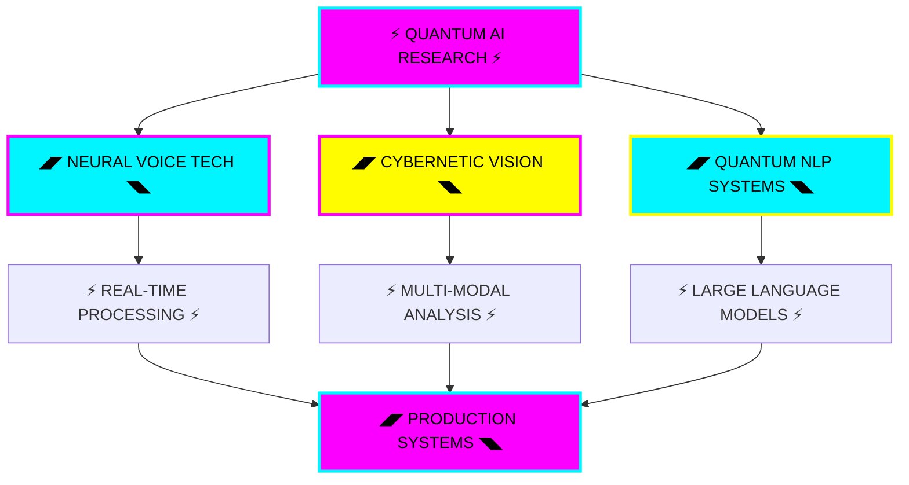

<div align="center">
  
</div>

<div align="center">
  
</div>

<div align="center">
  
</div>

<div align="center">


</div>

<div align="center">
  
</div>

## <div align="center">⚡ NEURAL NETWORK PROFILE ⚡</div>

<div align="center">
  
</div>

<div align="center">
<table>
<tr>
<td width="50%">

```python
class NeuralArchitect:
    def __init__(self):
        self.identity = "YOON JAE"
        self.designation = "AI NEURAL ARCHITECT"
        self.location = "JEJU CYBERNETIC HUB"
        self.institution = "JEJU HALLA UNIVERSITY"
        self.neural_interfaces = [
            "PYTHON_CORE_MATRIX",
            "JAVASCRIPT_QUANTUM_LAYER", 
            "KOREAN_NATURAL_LANGUAGE",
            "ENGLISH_GLOBAL_PROTOCOL"
        ]
        
    def neural_specialization(self):
        return {
            "DEEP_LEARNING": "ADVANCED_ARCHITECTURES",
            "COMPUTER_VISION": "REAL_TIME_PROCESSING", 
            "VOICE_SYNTHESIS": "NEURAL_CLONING",
            "NLP_SYSTEMS": "LARGE_LANGUAGE_MODELS"
        }
        
    def quantum_routine(self):
        return "RESEARCH >> CODE >> TRAIN >> DEPLOY >> EVOLVE"
```

</td>
<td width="50%">

```javascript
const NEURAL_OBJECTIVES = {
    CURRENT_FOCUS: [
        "► QUANTUM_AI_RESEARCH",
        "► NEURAL_VOICE_SYNTHESIS", 
        "► CYBERNETIC_VISION_SYSTEMS",
        "► DEEP_LEARNING_ARCHITECTURES"
    ],
    
    QUANTUM_MISSIONS_2025: [
        "◢◤ LAUNCH_AI_NEURAL_TOOLKIT",
        "◢◤ PUBLISH_VOICE_TECH_RESEARCH",
        "◢◤ CONTRIBUTE_MAJOR_OPENSOURCE",
        "◢◤ BUILD_PRODUCTION_AI_PLATFORM"
    ],
    
    NEURAL_STATUS: "ACTIVE_DEVELOPMENT",
    QUANTUM_LEVEL: "ADVANCED_RESEARCHER",
    CYBERNETIC_MODE: "CONTINUOUS_LEARNING"
};
```

</td>
</tr>
</table>
</div>

<div align="center">
  
</div>

## <div align="center">⚡ QUANTUM TECHNOLOGY MATRIX ⚡</div>

<div align="center">
  
</div>

<div align="center">

### ◢◤ NEURAL PROGRAMMING LANGUAGES ◥◣


### ◢◤ AI NEURAL FRAMEWORKS ◥◣


### ◢◤ QUANTUM DATA PROCESSING ◥◣


### ◢◤ CYBERNETIC DEVELOPMENT TOOLS ◥◣


</div>

<div align="center">
  
</div>

## <div align="center">⚡ NEURAL NETWORK PROJECTS ⚡</div>

<div align="center">
  
</div>

<div align="center">
<table>
<tr>
<td width="50%">

### ◢◤ QUANTUM VOICE SYNTHESIS ◥◣
**NEURAL_LINK**: [Real-Time-Voice-Cloning](https://github.com/yoonjae26/Real-Time-Voice-Cloning)

**QUANTUM_DESCRIPTION**: Advanced neural voice synthesis system capable of cloning any voice pattern with 5-second audio input, generating real-time speech through quantum processing.

**CYBERNETIC_FEATURES**:
- ⚡ Real-time quantum voice processing
- ⚡ 5-second neural voice cloning
- ⚡ High-fidelity speech synthesis
- ⚡ Production-ready architecture

**TECH_MATRIX**: `PYTHON` `DEEP_LEARNING` `AUDIO_PROCESSING` `NEURAL_NETWORKS`

**QUANTUM_STATUS**: **ACTIVE_DEVELOPMENT**

</td>
<td width="50%">

### ◢◤ CYBERNETIC FACE ANALYTICS ◥◣
**NEURAL_LINK**: [face_estimation](https://github.com/yoonjae26/face_estimation)

**QUANTUM_DESCRIPTION**: Advanced multi-modal face analysis system providing real-time detection and quantum predictions for age, gender, and emotional states through neural processing.

**CYBERNETIC_FEATURES**:
- ⚡ Multi-modal neural analysis
- ⚡ Real-time quantum processing
- ⚡ Custom trained AI models
- ⚡ High-precision predictions

**TECH_MATRIX**: `PYTHON` `OPENCV` `TENSORFLOW` `COMPUTER_VISION`

**QUANTUM_STATUS**: **ACTIVE_DEVELOPMENT**

</td>
</tr>
<tr>
<td width="50%">

### ◢◤ NEURAL TTS ENGINE ◥◣
**NEURAL_LINK**: [coqui-ai-TTS](https://github.com/yoonjae26/coqui-ai-TTS)

**QUANTUM_DESCRIPTION**: Production-grade Text-to-Speech quantum system built on advanced neural architectures, battle-tested in research and production environments.

**CYBERNETIC_FEATURES**:
- ⚡ Enterprise-grade performance
- ⚡ Multi-language neural support
- ⚡ Customizable voice models
- ⚡ Research-backed implementation

**TECH_MATRIX**: `PYTHON` `DEEP_LEARNING` `COQUI_AI` `NLP`

**QUANTUM_STATUS**: **PRODUCTION_READY**

</td>
<td width="50%">

### ◢◤ QUANTUM NLP RESEARCH ◥◣
**NEURAL_LINK**: [intronlp-2024](https://github.com/yoonjae26/intronlp-2024)

**QUANTUM_DESCRIPTION**: Comprehensive exploration of Natural Language Processing and Large Language Models, including cutting-edge quantum research and neural implementations.

**CYBERNETIC_FEATURES**:
- ⚡ LLM quantum experimentation
- ⚡ NLP technique implementations
- ⚡ Research documentation
- ⚡ Educational neural resources

**TECH_MATRIX**: `PYTHON` `TRANSFORMERS` `JUPYTER` `NLP_LIBRARIES`

**QUANTUM_STATUS**: **RESEARCH_ACTIVE**

</td>
</tr>
</table>
</div>

<div align="center">
  
</div>

## <div align="center">⚡ QUANTUM GITHUB ANALYTICS ⚡</div>

<div align="center">
  
</div>

<div align="center">
  
  
</div>

<div align="center">
  
</div>

<div align="center">
  
</div>

<div align="center">
  
</div>

## <div align="center">⚡ QUANTUM RESEARCH MATRIX ⚡</div>

<div align="center">
  
</div>



<div align="center">
<table>
<tr>
<td width="50%">

### ◢◤ CURRENT NEURAL RESEARCH ◥◣
- **⚡ QUANTUM AI ARCHITECTURES**: Exploring revolutionary neural network designs for next-generation AI applications
- **⚡ VOICE SYNTHESIS EVOLUTION**: Advancing real-time speech generation and quantum voice cloning technologies
- **⚡ CYBERNETIC VISION SYSTEMS**: Developing practical solutions for real-world computer vision problems
- **⚡ NEURAL LANGUAGE PROCESSING**: Building intelligent quantum language processing systems

</td>
<td width="50%">

### ◢◤ QUANTUM ROADMAP 2025 ◥◣
- **Q1**: Launch comprehensive quantum AI development toolkit
- **Q2**: Publish breakthrough research on voice technology advancements
- **Q3**: Contribute to major open-source neural AI projects
- **Q4**: Build production-ready quantum AI SaaS platform

</td>
</tr>
</table>
</div>

<div align="center">
  
</div>

## <div align="center">⚡ QUANTUM NEURAL CONNECTIONS ⚡</div>

<div align="center">
  
</div>

<div align="center">

### ◢◤ READY FOR QUANTUM COLLABORATION? ◥◣

<table>
<tr>
<td align="center">
<a href="https://www.facebook.com/profile.php?id=100033933143471">

</a>
</td>
<td align="center">
<a href="mailto:nguyenhoanglinh260801@gmail.com">

</a>
</td>
<td align="center">
<a href="https://github.com/yoonjae26">

</a>
</td>
<td align="center">
<a href="https://yoonjae26.github.io">

</a>
</td>
</tr>
</table>

</div>

<div align="center">
<table>
<tr>
<td width="50%">

### ◢◤ QUANTUM COLLABORATION PROTOCOLS ◥◣
- **⚡ AI/ML QUANTUM PROJECTS**: Building revolutionary solutions together
- **⚡ NEURAL RESEARCH PARTNERSHIPS**: Advancing artificial intelligence frontiers
- **⚡ OPEN SOURCE CONTRIBUTIONS**: Contributing to global AI quantum community
- **⚡ KNOWLEDGE NEURAL SHARING**: Mentoring and learning from fellow quantum developers

</td>
<td width="50%">

### ◢◤ QUANTUM CONSULTING OPPORTUNITIES ◥◣
- **⚡ ENTERPRISE AI SOLUTIONS**: Applying quantum AI expertise to real-world problems
- **⚡ NEURAL ARCHITECTURE CONSULTING**: Designing next-generation AI systems
- **⚡ QUANTUM RESEARCH COLLABORATION**: Joint research and development projects
- **⚡ CYBERNETIC TRAINING PROGRAMS**: Advanced AI education and workshops

</td>
</tr>
</table>
</div>

<div align="center">
  
</div>

<div align="center">
  
### ◢◤ BUILDING THE QUANTUM FUTURE, ONE NEURAL NETWORK AT A TIME ◥◣


</div>

<div align="center">
  
**◢◤ FROM [YOONJAE26](https://github.com/yoonjae26) | QUANTUM NEURAL ARCHITECT ◥◣**


</div>
