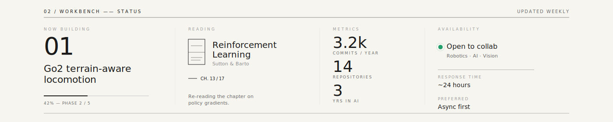
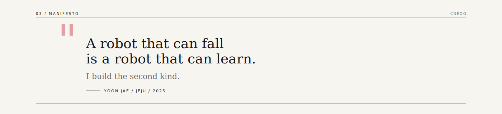

<!--
  ─────────────────────────────────────────────────────────────────
  Profile · Yoon Jae · v3
  Japanese-minimal aesthetic · Editor: hand-crafted
  ─────────────────────────────────────────────────────────────────
-->

  

 

  <a href="#now">Now</a>
  &nbsp;&nbsp;·&nbsp;&nbsp;
  <a href="#work">Work</a>
  &nbsp;&nbsp;·&nbsp;&nbsp;
  <a href="#stack">Stack</a>
  &nbsp;&nbsp;·&nbsp;&nbsp;
  <a href="#say-hello">Say hello</a>
  &nbsp;&nbsp;·&nbsp;&nbsp;
  <a href="#archive">Archive</a>

 
 

## Now

  

 
 

---

 

## Work

 

<table>
<tr>
<td width="50%" valign="top">

### 01 — Unitree Go2 autonomy
**Active · main focus**

Autonomous navigation for a 12-DoF quadruped. Custom RL locomotion policies trained in Isaac Sim, deployed on real hardware via ROS2 + Unitree SDK2.

The hard part isn't simulation. It's the transfer.

`ROS2` · `PyTorch` · `Isaac Sim` · `Unitree SDK2` · `C++` · `Python`

</td>
<td width="50%" valign="top">

### 02 — Real-time voice cloning
**[`Real-Time-Voice-Cloning`](https://github.com/yoonjae26/Real-Time-Voice-Cloning)**

Neural voice synthesis. Five seconds of reference audio produces a usable clone with sub-second latency.

`Python` · `PyTorch` · `Audio DSP`

</td>
</tr>
<tr>
<td width="50%" valign="top">

### 03 — Face estimation pipeline
**[`face_estimation`](https://github.com/yoonjae26/face_estimation)**

Multi-modal CV: age, gender, emotion. Runs 30 FPS on a CPU. No cloud.

`OpenCV` · `TensorFlow` · `CV`

</td>
<td width="50%" valign="top">

### 04 — Coqui TTS
**[`coqui-ai-TTS`](https://github.com/yoonjae26/coqui-ai-TTS)**

Production-grade TTS engine. Multi-language, customisable. Maintained.

`Python` · `DL` · `NLP`

</td>
</tr>
</table>

 
 

  

 
 

## Stack

<table>
<tr>
  <td><b>04 / STACK</b></td>
  <td></td>
</tr>
<tr>
  <td><b>Languages</b></td>
  <td>Python · C++ · TypeScript · JavaScript</td>
</tr>
<tr>
  <td><b>Deep learning</b></td>
  <td>PyTorch · TensorFlow · Hugging Face · scikit-learn</td>
</tr>
<tr>
  <td><b>Computer vision</b></td>
  <td>OpenCV · YOLO · MediaPipe</td>
</tr>
<tr>
  <td><b>Robotics</b></td>
  <td>ROS2 · Isaac Sim · Gazebo · Unitree SDK2</td>
</tr>
<tr>
  <td><b>Infrastructure</b></td>
  <td>Docker · Linux · CUDA · Git</td>
</tr>
<tr>
  <td><b>Daily drivers</b></td>
  <td>Neovim · tmux · Jupyter</td>
</tr>
</table>

 
 

---

 

## Say hello

 

<table>
<tr>
<td align="center" width="33%" valign="top">

**01**

### Leave a note
A guestbook. Two lines is fine.

[**Sign →**](https://github.com/yoonjae26/yoonjae26/discussions/new?category=guestbook)

</td>
<td align="center" width="33%" valign="top">

**02**

### Suggest a project
What should I build next?

[**Drop an idea →**](https://github.com/yoonjae26/yoonjae26/issues/new?title=Project+idea:+&labels=suggestion&body=Hi+Yoon+Jae,+I+think+you+should+build...)

</td>
<td align="center" width="33%" valign="top">

**03**

### Collaborate
Robotics, vision, voice — let's compare notes.

[**Open a thread →**](https://github.com/yoonjae26/yoonjae26/discussions/new?category=ideas)

</td>
</tr>
</table>

 

<b>The hidden one — for the curious</b>

 

There is a key somewhere on this page. It is a number.

Find it, then [open this issue](https://github.com/yoonjae26/yoonjae26/issues/new?title=Found+it&labels=easter-egg&body=The+number+is:+) with the answer. The first ten get added to the **Hall of the Curious**.

Hint: Look at the banner. Read the technical drawing carefully.

<b>Other ways to reach me</b>

 

- [Get started with Unitree Go2 — where do I begin?](https://github.com/yoonjae26/yoonjae26/discussions/new?category=q-a&title=Getting+started+with+Unitree+Go2)
- [Mentoring request](https://github.com/yoonjae26/yoonjae26/discussions/new?category=q-a&title=Mentoring+request)
- [Consulting inquiry](mailto:nguyenhoanglinh260801@gmail.com?subject=Consulting%20Inquiry)
- [Personal site](https://yoonjae26.github.io)

 
 

---

 

## Archive

**05 / RECENT ACTIVITY**

<!-- LATEST_POSTS:START -->
- 📝  **pushed** &nbsp;·&nbsp; [DDPM-U-Net-From-Noise-to-Latent-Diffusion](https://github.com/yoonjae26/DDPM-U-Net-From-Noise-to-Latent-Diffusion) &nbsp;·&nbsp; 12d ago
- 🔀  merged PR &nbsp;·&nbsp; [DDPM-U-Net-From-Noise-to-Latent-Diffusion](https://github.com/yoonjae26/DDPM-U-Net-From-Noise-to-Latent-Diffusion) &nbsp;·&nbsp; 12d ago
- 🔀  opened PR &nbsp;·&nbsp; [DDPM-U-Net-From-Noise-to-Latent-Diffusion](https://github.com/yoonjae26/DDPM-U-Net-From-Noise-to-Latent-Diffusion) &nbsp;·&nbsp; 12d ago
- 🌿  New branch `main` in [DDPM-U-Net-From-Noise-to-Latent-Diffusion](https://github.com/yoonjae26/DDPM-U-Net-From-Noise-to-Latent-Diffusion) &nbsp;·&nbsp; 12d ago
- 📝  **pushed** &nbsp;·&nbsp; [yoonjae26](https://github.com/yoonjae26/yoonjae26) &nbsp;·&nbsp; 26d ago
<!-- LATEST_POSTS:END -->

 

<b>The numbers — for those who like numbers</b>

 

  
  

 
 

---

 

  
    <i>余白を残す</i> &nbsp;·&nbsp; Leave space in the margin.
  

  
    <a href="https://yoonjae26.github.io">yoonjae26.github.io</a> &nbsp;·&nbsp;
    Jeju, KR
  

 
