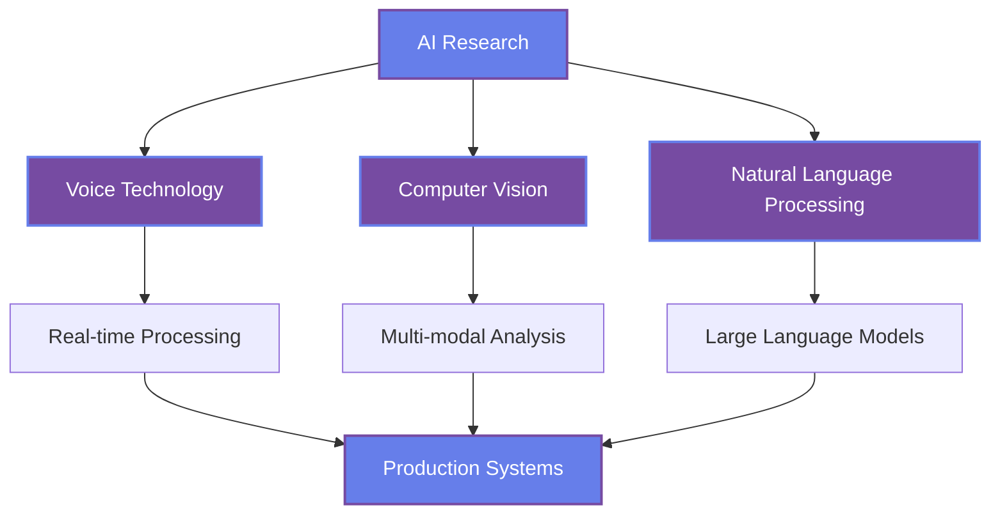

<div align="center">
  
</div>

<div align="center">
  
</div>

<div align="center">
  


</div>


## About Me

<div align="center">
  
</div>

<table>
<tr>
<td width="50%">

**Professional Focus**
- **Role**: AI Developer & ML Engineer
- **Location**: Jeju Island, South Korea
- **Education**: Jeju Halla University
- **Languages**: Python, JavaScript, Korean, English

**Current Research**
- Natural Language Processing
- Voice Synthesis & Cloning
- Computer Vision Applications
- Deep Learning Architectures

</td>
<td width="50%">

**Technical Philosophy**
```python
class AIEngineer:
    def __init__(self):
        self.passion = "Building AI solutions"
        self.focus = ["NLP", "Computer Vision", "Voice AI"]
        self.methodology = "Research → Code → Deploy"
        
    def daily_routine(self):
        return "Code → Train Models → Innovate"
```

**Achievement Goals**
- Contributing to open-source AI projects
- Publishing research in voice technology
- Building production-ready AI systems
- Sharing knowledge with the community

</td>
</tr>
</table>


## Technology Stack

<div align="center">


### Programming Languages


### AI/ML Frameworks


### Data Science & Analytics


### Development Tools


</div>


## Featured Projects

<div align="center">
  
</div>

<table>
<tr>
<td width="50%">

### Real-Time Voice Cloning
**Repository**: [Real-Time-Voice-Cloning](https://github.com/yoonjae26/Real-Time-Voice-Cloning)

**Description**: Advanced voice synthesis system that clones any voice with just 5 seconds of audio input, generating speech in real-time.

**Key Features**:
- Real-time voice processing
- 5-second voice cloning
- High-quality speech synthesis
- Production-ready implementation

**Tech Stack**: `Python` `Deep Learning` `Audio Processing` `Neural Networks`

**Status**: Active Development

</td>
<td width="50%">

### AI Face Analytics
**Repository**: [face_estimation](https://github.com/yoonjae26/face_estimation)

**Description**: Comprehensive face analysis system providing real-time detection and multi-modal predictions for age, gender, and emotions.

**Key Features**:
- Multi-modal face analysis
- Real-time video processing
- Custom trained models
- High accuracy predictions

**Tech Stack**: `Python` `OpenCV` `TensorFlow` `Computer Vision`

**Status**: Active Development

</td>
</tr>
<tr>
<td width="50%">

### Advanced TTS Engine
**Repository**: [coqui-ai-TTS](https://github.com/yoonjae26/coqui-ai-TTS)

**Description**: Production-grade Text-to-Speech system built on Coqui AI, battle-tested in research and production environments.

**Key Features**:
- Enterprise-grade performance
- Multi-language support
- Customizable voice models
- Research-backed implementation

**Tech Stack**: `Python` `Deep Learning` `Coqui AI` `NLP`

**Status**: Production Ready

</td>
<td width="50%">

### NLP Research Hub
**Repository**: [intronlp-2024](https://github.com/yoonjae26/intronlp-2024)

**Description**: Comprehensive exploration of Natural Language Processing and Large Language Models, including cutting-edge research and implementations.

**Key Features**:
- LLM experimentation
- NLP technique implementations
- Research documentation
- Educational resources

**Tech Stack**: `Python` `Transformers` `Jupyter` `NLP Libraries`

**Status**: Research & Learning

</td>
</tr>
</table>


## GitHub Analytics

<div align="center">
  
</div>

<div align="center">
  
  
</div>

<div align="center">
  
</div>

<div align="center">
  
</div>


## Research Focus & Roadmap

<div align="center">
  
</div>



### Current Research Areas
- **Deep Learning Architecture**: Exploring novel neural network designs for AI applications
- **Voice Synthesis Innovation**: Advancing real-time speech generation and voice cloning
- **Computer Vision Applications**: Developing practical solutions for real-world problems
- **NLP & LLM Integration**: Building intelligent language processing systems

### 2025 Research Roadmap
- **Q1**: Launch comprehensive AI development toolkit
- **Q2**: Publish research on voice technology advancements
- **Q3**: Contribute to major open-source AI projects
- **Q4**: Build production-ready AI SaaS platform


## Connect & Collaborate

<div align="center">
  
</div>

<div align="center">

### Ready to discuss AI, collaborate on projects, or share knowledge?

<table>
<tr>
<td align="center">
<a href="https://www.facebook.com/profile.php?id=100033933143471">

</a>
</td>
<td align="center">
<a href="mailto:nguyenhoanglinh260801@gmail.com">

</a>
</td>
<td align="center">
<a href="https://github.com/yoonjae26">

</a>
</td>
<td align="center">
<a href="https://yoonjae26.github.io">

</a>
</td>
</tr>
</table>

</div>

### Open to Collaboration
- **AI/ML Project Development**: Building innovative solutions together
- **Research Partnerships**: Advancing the field of artificial intelligence
- **Open Source Contributions**: Contributing to the global AI community
- **Knowledge Sharing**: Mentoring and learning from fellow developers
- **Consulting Opportunities**: Applying AI expertise to real-world problems

<div align="center">
  
</div>

<div align="center">
  
### Building the future, one AI model at a time


</div>

<div align="center">
  
**From [yoonjae26](https://github.com/yoonjae26) | Made with passion for AI and innovation**


</div>
